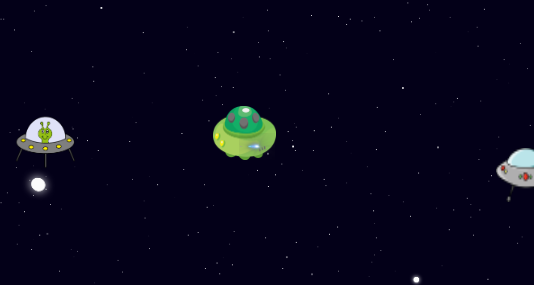

# Space Shooter Alien

## Sobre o projeto.
Jogo de tiro com Aliens. Defenda sua vida e seu planeta para que a invasão seja impedida. Acerte todas as naves sem deixar que eles te peguem.

Data de conclusão: 08/05/2022

## Ferramentas e tecnologias usadas nesse projeto.
 
```js
function SpaceShooterAlien(Project) {
    if (Front End) {
        const Stack = `${HTML}, ${CSS}, ${JavaScript}`;
    }
};
```
<br>

<div align="center">



</div>

---

> - Autores: 
>   - [Eduardo Kayke](https://github.com/EduardoKayke "Perfil do Eduardo")

- [Voltar ao perfil do Github.](https://github.com/EduardoKayke "Perfil do Eduardo")

_Um dia seremos a tecnologia. Biohacking a própria evolução de nós mesmos._
